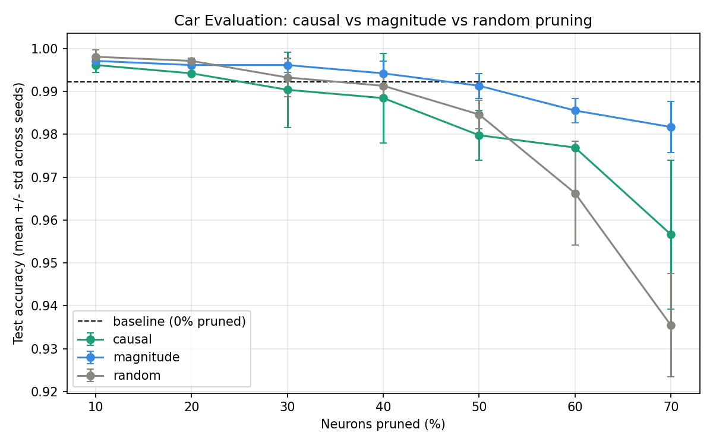
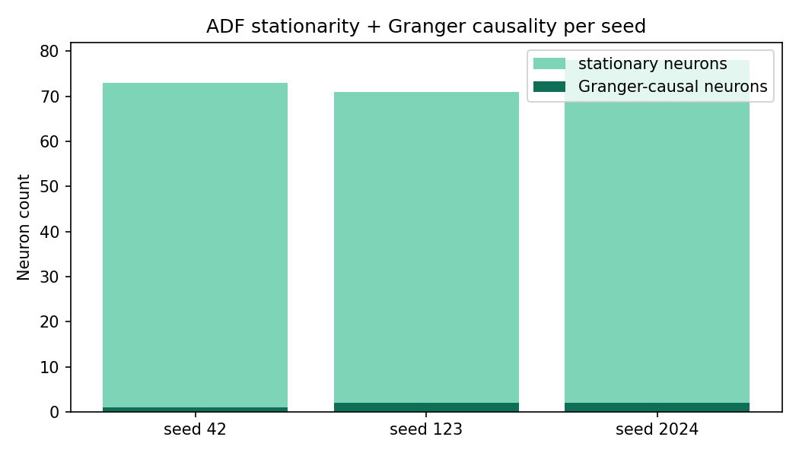

# Car Evaluation: Causal Neuron Pruning

This directory is the Car Evaluation module of the [Neural Network Efficiency
project](../README.md). It studies whether hidden neurons can be removed from a
small multilayer perceptron while preserving predictive quality and reducing
model complexity.

The experiment compares three structural pruning strategies under the same
training and fine-tuning protocol:

| Method | Importance signal |
| --- | --- |
| `causal` | Weight magnitude + activation strength + ADF-filtered Granger causality |
| `magnitude` | Mean absolute incoming weight magnitude |
| `random` | Reproducible random neuron selection baseline |

## Results at a glance

The checked-in results are from seeds `42`, `123`, and `2024`, with pruning
levels from 10% to 70%. The unpruned baseline averages **99.56% accuracy**.
At 70% pruning, the models retain the following mean accuracy:

| Method | Accuracy | F1 score | Parameters | Parameter reduction |
| --- | ---: | ---: | ---: | ---: |
| Causal | 95.66% +/- 1.74% | 85.96% +/- 8.74% | 694 | 80.8% |
| Magnitude | 98.17% +/- 0.60% | 96.09% +/- 2.41% | 694 | 80.8% |
| Random | 93.55% +/- 1.20% | 72.12% +/- 9.44% | 694 | 80.8% |

These results do not claim that causal pruning wins every setting. They show
that it is competitive with magnitude pruning and substantially stronger than
random pruning at aggressive compression levels. The complete per-seed data
and all pruning levels are in `results/summary_mean_std.csv` and
`results/combined_results.csv`.

### Experiment figures





## Research contribution

### 1. Stationarity-aware causal testing

Every logged neuron activation series is checked with the Augmented Dickey-
Fuller test before Granger testing. Non-stationary series are differenced once
and tested again; series that remain non-stationary are excluded from causal
importance scoring. This reduces the risk of interpreting spurious regression
as causal evidence.

### 2. Neuron-to-output causality

The implementation tests whether each hidden neuron's activation history
Granger-causes the model's true-class output probability. This is an O(N)
analysis over neurons, rather than an O(N^2) neuron-to-neuron matrix.

### 3. Matched baselines and multiple seeds

Causal, magnitude, and random pruning use the same model, dataset split,
pruning percentages, and fine-tuning procedure. Results are repeated across
three seeds and reported as mean +/- standard deviation.

## Pipeline

```text
Load OpenML Car Evaluation data
   |
Train baseline MLP
   |
Log hidden activations and true-class probabilities
   |
ADF stationarity test -> neuron-to-output Granger test
   |
Score neurons -> structurally rebuild smaller MLP
   |
Fine-tune -> evaluate accuracy, F1, size, parameters, latency
```

## Repository layout

```text
car_eval_causal_pruning_project/
├── Car_Evaluation_Causal_Pruning.ipynb  # self-contained Colab notebook
├── run_experiment.py                    # command-line entry point
├── requirements.txt
├── src/
│   ├── config.py                         # seeds and experiment settings
│   ├── data.py                           # OpenML loading and encoding
│   ├── model.py                          # MLP and structural rebuilding
│   ├── trainer.py                        # training and activation logging
│   ├── causality.py                      # ADF and Granger analysis
│   ├── pruning.py                        # importance scores and pruning
│   ├── evaluation.py                     # metrics and efficiency measures
│   ├── experiment.py                     # multi-seed experiment orchestration
│   └── visualization.py                  # publication-ready result plots
└── results/                              # reproducible CSVs and figures
```

## Setup and execution

From the parent repository:

```powershell
cd car_eval_causal_pruning_project
python -m venv .venv
.\.venv\Scripts\Activate.ps1
python -m pip install -r requirements.txt
python run_experiment.py
```

For a quick smoke run:

```powershell
python run_experiment.py --seeds 42 --prune-pcts 20 50 --epochs-baseline 15 --epochs-finetune 5
```

The dataset is downloaded from OpenML on the first run. Internet access is
therefore required. A GPU is optional because the network is intentionally
small.

### Google Colab

Open `Car_Evaluation_Causal_Pruning.ipynb` in Colab and run the cells from top
to bottom. The notebook installs dependencies, materializes the source package,
runs the experiment, and displays the result files.

## Generated outputs

| Output | Description |
| --- | --- |
| `combined_results.csv` | Every seed, method, and pruning-level measurement |
| `summary_mean_std.csv` | Mean and standard deviation by method and pruning level |
| `causality_summary.csv` | Stationary and causal neuron counts for each seed |
| `causality_seed<N>.csv` | Per-neuron ADF and Granger statistics |
| `activations_seed<N>.csv` | Logged hidden activations and output probabilities |
| `method_comparison.png` | Accuracy versus pruning with error bars |
| `causality_summary.png` | Stationarity and causality counts by seed |

## Configuration

Adjust experiment settings in `src/config.py` or override the main runtime
settings from the command line:

```text
GRANGER_MAX_LAG = 5
GRANGER_SAMPLE = 400
ADF_ALPHA = 0.05
GRANGER_ALPHA = 0.05
```

The lag is intentionally set to 5 for the short activation trajectories. A
higher lag can be tested, but it reduces the available regression degrees of
freedom and should be reported as an experimental change.

## Limitations

- OpenML availability is required to fetch the dataset.
- The study uses a compact tabular MLP; results should not be generalized to
  CNNs or transformer models without new experiments.
- Inference timings are hardware- and runtime-dependent.
- Granger causality indicates predictive temporal usefulness in the logged
  series; it is not proof of physical or mechanistic causation.

## Citation and project context

This module supports the final-year project on increasing neural network
efficiency using neuron pruning, model compression, and Granger-causality-based
importance analysis. See the parent [project README](../README.md) for the
broader MNIST module, dashboards, authors, and future extensions.

## License

This module is distributed under the parent repository's [MIT License](../LICENSE).
